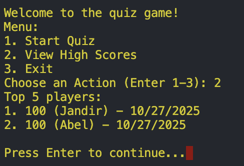

# Project Overview

This project is a command-line quiz game where users can start a quiz, and view the highest. If the player scores a high score, they can be added to the top 5 players. The application stores the quiz questions in a array of objects, and the top 5 players in a different array of objects. The top 5 players are also saved in a JSON file to keep track of the players even if the application stops.

## Key Features & Usage Example

After running the application, the user is presented with a menu of options, where they can:

1. Start the quiz
2. View High Scores
3. Exit the program

The screenshot belows shows the top 5 players after selection **"View High Scores"**.



## Setup

Follow these steps to get started:

```sh
# Clone the repo
git clone git@github.com:JandirGregorio/swe-project-1-cli-app.git
cd swe-project-1-cli-app.git

# Install dependencies
npm install

# Run the src/index.js file
node src/index.js

# Or, you can use the start command shortcut
npm start

# Or, run in developer mode using nodemon
npm run dev
```

## Key Technologies and Packages

- Node
- 'prompt-sync'
- 'fs'
- 'path'
